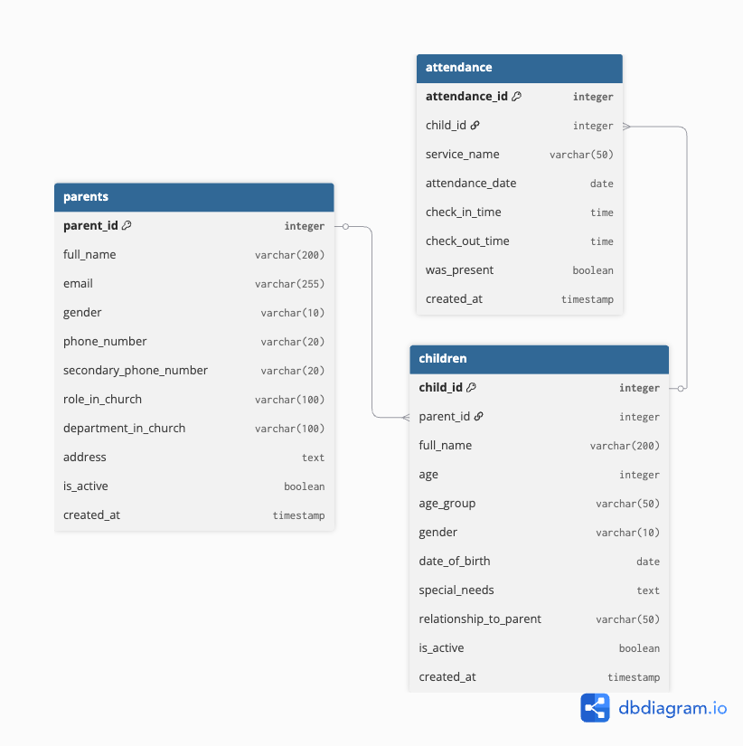

# Household of David Church – Junior Church Attendance Tracking System

---

## TABLE OF CONTENTS

1. [Project Overview](#1-project-overview)
2. [Database Architecture](#2-database-architecture)
3. [Initial Data Migration](#3-initial-data-migration)
4. [Automated Weekly Pipeline](#4-automated-weekly-pipeline)
5. [Dashboard & Reporting](#5-dashboard--reporting)

---

## 1. Project Overview

### Problem

The Junior Church attendance process relied on multiple Google Sheets with:

* Duplicate parent records across different service sheets
* A wide, unstructured format (parent + multiple children in one row)
* No automated reporting
* Manual data consolidation required weekly
* No reliable historical reporting

This made it difficult to track attendance trends, manage class sizes, and retrieve accurate parent or child information.

### Solution

A simple, maintainable data system that:

* Automates weekly attendance collection via Google Forms
* Normalizes unstructured Google Sheets data into a relational PostgreSQL database
* Supports **one‑time historical migration** and **automated weekly updates**
* Powers a **live attendance dashboard** for leadership and teachers
* Eliminates manual data entry and consolidation

### Tech Stack

* **Database:** PostgreSQL (Supabase – managed hosting)
* **ETL:** Python (pandas, psycopg2)
* **Data Source:** Google Forms > Google Sheets
* **Dashboard:** Google Looker Studio

---

## 2. Database Architecture

### Entity-Relationship Diagram (ERD)



### Design Principles

* Eliminate duplication
* Preserve historical records
* Enforce data integrity using foreign keys
* Keep schema simple and extensible

### Entity Relationships

* One parent can have many children
* One child can have many attendance records
* Attendance is recorded per child, per service, per date

---
### Database Schema

#### Table 1: `parents`

Stores unique parent or guardian information.

**Purpose:** Stores unique parent/guardian contact information

| Column | Type | Constraints | Description |
|--------|------|-------------|-------------|
| parent_id | INTEGER | PRIMARY KEY, AUTO_INCREMENT | Unique identifier |
| full_name | VARCHAR(200) | NOT NULL | Parent's full name |
| email | VARCHAR(255) | | Email address |
| gender | VARCHAR(10) | NOT NULL | Male or Female |
| phone_number | VARCHAR(20) | | Primary contact number |
| secondary_phone_number | VARCHAR(20) | | Alternative contact |
| role_in_church | VARCHAR(100) | | Church role (Member, Usher, etc.) |
| department_in_church | VARCHAR(100) | | Department affiliation |
| address | TEXT | | Home address |
| is_active | BOOLEAN | DEFAULT TRUE | Active status (soft delete) |
| created_at | TIMESTAMP | DEFAULT NOW() | Record creation time |
| updated_at | TIMESTAMP | AUTO-UPDATE | Last modification time |

**Notes:**

* At least one contact method (email OR phone) required
* is_active = FALSE preserves historical data for inactive families

**Indexes:**
- Primary key on `parent_id`
- Index on `phone_number` (for fast parent lookup during attendance)
- Index on `email`

---

#### Table 2: `children`

Stores child information linked to a parent.

| Column | Type | Constraints | Description |
|--------|------|-------------|-------------|
| child_id | INTEGER | PRIMARY KEY, AUTO_INCREMENT | Unique identifier |
| parent_id | INTEGER | FOREIGN KEY → parents, NOT NULL | Links to parent |
| full_name | VARCHAR(200) | NOT NULL | Child's full name |
| age | INTEGER | NOT NULL (if no DOB) | Current age in years |
| age_group | VARCHAR(50) | AUTO-CALCULATED | Class assignment |
| gender | VARCHAR(10) | NOT NULL | Male or Female |
| date_of_birth | DATE | OPTIONAL | Birth date (preferred) |
| special_needs | TEXT | | Medical/care requirements |
| relationship_to_parent | VARCHAR(50) | AUTO-FILLED | Son/Daughter/Ward |
| is_active | BOOLEAN | DEFAULT TRUE | Active status |
| created_at | TIMESTAMP | DEFAULT NOW() | Record creation time |
| updated_at | TIMESTAMP | AUTO-UPDATE | Last modification time |

**Age Groups:**

* 0–2 years: Nursery
* 3–5 years: Kindergarten
* 6–9 years: Primary
* 10–12 years: Juniors
* 13+ years: Teens

**Notes:**
- Must provide either `date_of_birth` OR `age`
- If DOB provided, age is automatically calculated
- Relationship auto-filled: Male > Son, Female > Daughter
- ON DELETE CASCADE: Deleting parent removes their children

**Indexes:**
- Primary key on `child_id`
- Foreign key on `parent_id`
- Index on `age_group` (for class-based queries)

---

### Table 3: `attendance`

Tracks individual child attendance at each service

| Column | Type | Constraints | Description |
|--------|------|-------------|-------------|
| attendance_id | INTEGER | PRIMARY KEY, AUTO_INCREMENT | Unique identifier |
| child_id | INTEGER | FOREIGN KEY → children, NOT NULL | Links to child |
| service_name | VARCHAR(50) | NOT NULL | First/Second/Third Service |
| attendance_date | DATE | NOT NULL | Date of attendance |
| check_in_time | TIME | | Check-in time |
| check_out_time | TIME | | Check-out time |
| was_present | BOOLEAN | DEFAULT TRUE | Attendance flag |
| created_at | TIMESTAMP | DEFAULT NOW() | Record creation time |

**Notes:**

* Unique constraint on `(child_id, service_name, attendance_date)` prevents duplicates
* Same child can attend multiple services on same date (creates separate records)
* ON DELETE CASCADE: Deleting child removes their attendance records

---

### Primary Keys

**Primary Keys (Auto-Incrementing):**
- `parents.parent_id` - Ensures unique parent identification
- `children.child_id` - Ensures unique child identification  
- `attendance.attendance_id` - Ensures unique attendance records

---

## 3. Initial Data Migration

### Source

* **Format:** Excel file exported from Google Sheets
* **Structure:** 3 sheets (First Service, Second Service, Third Service)
* **Total:** 900 rows (300 parents appearing in multiple services)
* **Columns:** 41 per row (parent info + 3 children with nested columns)

### Migration Steps

1. Data was extracted from Excel sheets
2. Parents data were deduplicated using phone number
3. Children data were normalized into individual records
4. Attendance records were inserted per service and date
5. Cleaned data was loaded into PostgreSQL

### Outcome

* Duplicate parent records eliminated
* Children stored once per parent
* Attendance history preserved per service

This migration is **one‑time only**.

---

## 4. Automated Weekly Attendance Pipeline

### Overview

Weekly attendance is collected using Google Forms and processed automatically without manual intervention.

### Workflow


```
Google Form Submission
        ↓
Google Sheets (Responses)
        ↓
Public CSV Export URL
        ↓
Scheduled Python ETL Script
        ↓
PostgreSQL Database
        ↓
Looker Studio Dashboard
```
### Google Form Questions

**Required Questions:**
**Section 1: Parent Information (All Required)**

1. Parent Full Name (Short answer)
2. Parent Phone Number (Short answer) 
3. Parent Gender (Multiple choice, Required)
4. Which Service? (Dropdown: First Service, Second Service, Third Service)

**Section 2:**
5. Child 1 Name (Short answer)
6. Child 1 Age (Number)
7. Child 1 Gender (Multiple choice: Male, Female)

**Section 3: Child 2 (Same as Child 1)**
**Section 4: Child 3 (Same as Child 1)**

**Expected CSV Columns:**
```
| Timestamp | Parent Full Name | Parent Phone Number | Parent Gender | Child 1 Name | Child 1 Age | Child 1 Gender | Which Service |
```

### Handling New Parents

The system automatically handles first-time attendees:

**Scenario: New Family Attends**
1. Parent fills Google Form with their phone number
2. ETL script checks: `SELECT parent_id FROM parents WHERE phone_number = '080...'`
3. Result: Not found (new parent)
4. Script creates: New parent record with name, phone, gender
5. Script creates: New child records linked to new parent
6. Script records: Attendance for all children

**Result:** New family is immediately added to database with zero manual intervention.

**Matching Strategy:**
- **Parents matched by:** Phone number (unique identifier)
- **Children matched by:** Parent ID + Child name + Age
- **Duplicates prevented by:** Database constraints

**Data Quality:**
- Invalid genders default to "Male"
- Missing timestamps default to current date
- Empty child fields are skipped (not all 3 child slots required)

### Why CSV Export (No OAuth)

To keep the system simple and fully automated:

* No Google account authentication required
* No credential rotation or browser authorization
* Script can run on any machine or server

The Google Sheet is shared as **read‑only** and accessed via its public CSV export URL.

---

### ETL Logic (Weekly)

1. Download latest form responses via CSV URL
2. For each submission:

   * Match parent by phone number (create if missing)
   * Match child by parent + name + age (create if missing)
   * Insert attendance record (skip if already exists)
3. Commit updates to database

The process is **idempotent** — running it multiple times does not create duplicates.

### Scheduling

* Can be run manually or scheduled weekly using:

  * Cron (Linux/Mac)
  * Task Scheduler (Windows)
  * Cloud runner (GitHub Actions, server, etc.)

---

## 5. Dashboard & Reporting

### Tool

* Google Looker Studio connected directly to PostgreSQL
* **URL:** [[Looker Studio Dashboard Link](https://lookerstudio.google.com/reporting/ad74acad-7468-42a6-85cc-72b0870cbc8d)]

#### Key Metrics (Scorecards)

1. **Total Children:** Count of registered children
2. **Total Parents:** Count of registered parents
3. **Weekly Attendance:** Children who attended this week
4. **Attendance Rate:** (Weekly attendance / Total children) × 100

#### Visualizations

1. **Age Group Distribution (Pie Chart)**
   - Shows breakdown by Nursery, Kindergarten, Primary, Juniors, Teens
   - Helps with class planning and resource allocation

2. **Service Attendance Comparison (Bar Chart)**
   - Compares attendance across First, Second, Third Service
   - Identifies most popular service times

3. **Children Roster (Searchable Table)**
   - Lists all children with parent contact info
   - Sortable, searchable, exportable

4. **Special Needs Children (Filtered Table)**
   - Highlights children requiring special care
   - Includes parent emergency contacts

5. **Weekly Attendance Trends (Line Chart)** (To be Included)
   - Shows attendance over past 12 weeks
   - Identifies growth or decline trends

### Data Freshness

* Dashboard reflects latest database state
* Updates automatically after ETL runs

---

## Conclusion

This system replaces manual attendance tracking with a reliable, automated, and scalable data pipeline.

**Key Benefits:**

* Clean and normalized data model
* Fully automated weekly updates
* No dependency on individual computers
* Centralized database accessible by the tech team
* Real‑time visibility into attendance patterns

The solution provides a solid foundation for future enhancements such as SMS notifications, volunteer planning, and long‑term attendance analytics.
